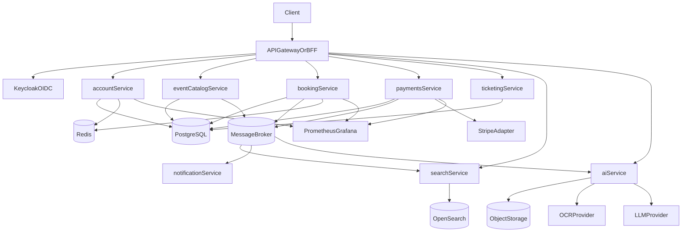
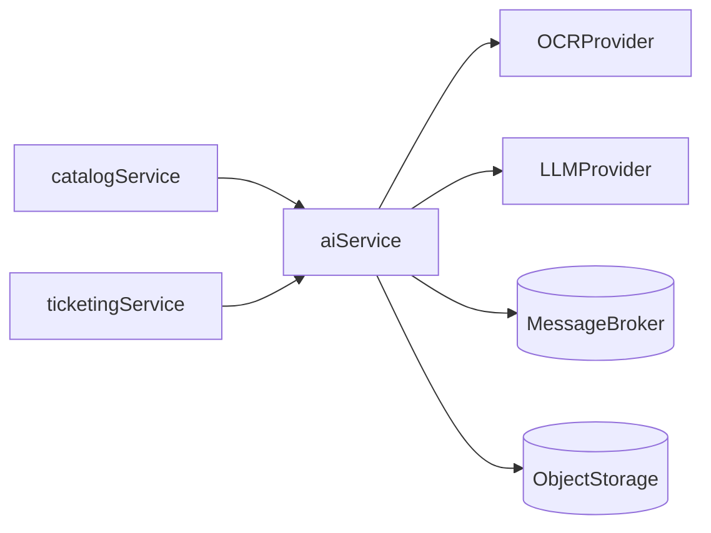

# EventMint — Product Vision v1

## Overview

**EventMint** is an event ticketing platform where organizers publish events and sell tickets, and customers browse events, reserve seats, pay, and receive digital tickets.

The project starts as a learning-oriented backend with enterprise patterns (transactions, payments, IAM, async processing) and evolves toward a production-grade microservices architecture.

## Problem Statement

Organizers need a reliable way to sell limited ticket inventory online. Customers need a simple flow to discover events, purchase tickets, and access them digitally. The system must prevent overselling, handle payment failures gracefully, and maintain a clear audit trail.

## Target Users

| Actor | Description |
|-------|-------------|
| **Customer** | Browses events, reserves tickets, pays, views owned tickets |
| **Organizer** | Creates and manages events, ticket types, pricing, and check-in |
| **Admin** | Platform oversight, moderation, operational support |

## Core Value Proposition

- Safe ticket inventory management (no overselling)
- End-to-end purchase flow with payment integration
- Digital ticket issuance and check-in
- Observable, auditable, and recoverable backend processes

## Core User Flows

### Customer flow

```
Browse events -> Select ticket type -> Reserve seats -> Pay -> Receive ticket -> View in "My tickets"
```

### Organizer flow

```
Login -> Create event -> Configure ticket types -> Publish -> Monitor sales -> Check-in attendees
```

### Failure / recovery flow

```
Payment failed -> Release reservation
Payment succeeded, booking failed -> Refund + compensation
Duplicate webhook -> Idempotent processing (no double charge)
Reservation timeout -> Auto-cancel and release inventory
```

## Product Scope

### In scope (v1)

**Identity & access** (partially implemented)
- User registration and login
- JWT access and refresh tokens
- Roles: `USER`, `ORGANIZER`, `ADMIN`

**Event catalog**
- Create, update, publish, and archive events
- Ticket types with price and capacity
- Event metadata: title, date, location, description

**Booking / orders**
- Temporary seat reservation (e.g. 10–15 minutes)
- Order confirmation after successful payment
- Order cancellation and reservation timeout
- Inventory locking to prevent overselling

**Payments**
- Stripe sandbox integration
- Payment state machine: `PENDING -> PAID -> REFUNDED / FAILED`
- Webhook verification and idempotent handling

**Ticketing**
- Digital ticket issuance after payment
- "My tickets" view for customers
- Check-in endpoint for organizers

**Platform operations**
- Health and readiness endpoints
- Prometheus metrics and structured logging
- Audit log for critical state changes

### Out of scope (v1)

- Mobile apps (API-first only)
- Multi-currency and complex tax rules
- Secondary ticket marketplace / reselling
- Full Keycloak SSO (planned for later phase)
- Advanced analytics and recommendations

## Target Architecture

Current state:

```
Client -> auth (9001) -> account (9000) -> PostgreSQL
              |              |
              +---- Redis ---+
```

Target state:



### Planned services

| Service | Responsibility |
|---------|----------------|
| **account** | User profiles, credentials, roles |
| **auth** | Login, token issuance (later: OIDC via Keycloak) |
| **catalog** | Events, venues, ticket types |
| **booking** | Reservations, orders, inventory locking |
| **payments** | Payment intents, webhooks, refunds, reconciliation |
| **ticketing** | Ticket issuance, QR/token, check-in |
| **notifications** | Email/push for order and payment events |
| **search** | OpenSearch indexing and query API (read model) |
| **ai** | OCR, content analysis, fraud scoring, support assistant |

## Future Platform Capabilities

These components extend the core ticketing platform and provide strong enterprise learning value. They are planned as separate services or cross-cutting concerns, not mixed into booking or payments logic.

### Multi-tenancy

**Tenant model:** each organizer organization is a tenant (`tenantId` / `orgId`).

All tenant-owned resources are scoped: events, ticket types, orders, payments, tickets.

| Strategy | Complexity | Recommendation |
|----------|------------|----------------|
| Shared DB + `tenant_id` column | Low | Start here (MVP multi-tenant v1) |
| Schema per tenant | Medium | When stronger data isolation is required |
| DB per tenant | High | Enterprise / regulated clients |

**Implementation requirements:**
- `TenantContext` middleware (resolved from JWT or API key)
- Repository/query guard: every query includes `WHERE tenant_id = :tenantId`
- RBAC per tenant: `ORG_ADMIN`, `ORG_STAFF`, `CUSTOMER`
- Tenant onboarding flow for new organizers
- Stripe Connect for per-tenant payout accounts (later phase)

**When to add:** Phase 1 (early). Adding tenancy later requires painful refactors across all services.

### OpenSearch

PostgreSQL remains the source of truth. OpenSearch is a read/search model (CQRS).

**Use cases:**

| Scenario | Purpose |
|----------|---------|
| Event discovery | Full-text and fuzzy search on title, description, tags |
| Faceted filters | City, date range, price, category |
| Autocomplete | Search suggestions (e.g. "conc..." → concerts) |
| Analytics | Top events, conversion funnel, sales by region |
| Ops logs (optional) | Centralized log search across microservices |

**Integration pattern:**

```
catalog (PostgreSQL, source of truth)
  -> outbox / domain event
  -> search-indexer worker
  -> OpenSearch index (events_v1)
```

**Requirements:**
- Index versioning (`events_v1`, `events_v2`) for schema changes
- Reindex job for disaster recovery
- Eventual consistency between catalog and search index

**When to add:** Phase 1–2, after `catalog-service` is in place.

### AI / OCR microservice

A dedicated `ai-service` handles intelligence workloads asynchronously. It does not block core booking or payment flows.

**Use cases:**

| Use case | What the AI service does |
|----------|--------------------------|
| Organizer onboarding | OCR poster/PDF → extract event title, date, venue |
| Check-in validation | OCR ID document + match with ticket holder (anti-fraud) |
| Content moderation | Scan event descriptions for spam or toxic content |
| Support assistant | RAG-based answers: "Where is my ticket?", refund policy |
| Fraud detection | Score anomalies in orders and payments |

**Architecture:**



**API design:**
- Async job API: `POST /analyze`, `GET /jobs/{id}`
- Provider abstraction (AWS Textract, Google Vision, Tesseract, LLM providers)
- Store raw input, result, confidence score, and audit trail

**When to add:** Phase 3, after booking and payments are stable and domain events are in place.

### Capability summary

| Component | Feasible | Learning value | Target phase |
|-----------|----------|----------------|--------------|
| Multi-tenancy | Yes | Critical for B2B SaaS | Phase 1 |
| OpenSearch | Yes | CQRS, indexing, search at scale | Phase 1–2 |
| AI / OCR service | Yes | Async jobs, provider adapters, audit | Phase 3 |

## Enterprise Patterns to Learn

| Pattern | Where it applies |
|---------|------------------|
| ACID transactions | Seat reservation, order confirmation |
| Saga / process manager | Booking ↔ Payment ↔ Ticketing coordination |
| Outbox pattern | Reliable domain event publishing |
| Idempotency keys | Payment webhooks, order creation |
| State machines | Order, payment, ticket lifecycle |
| RBAC / OIDC | Organizer vs customer vs admin access |
| Multi-tenancy | Tenant-scoped data isolation (`tenant_id`, TenantContext) |
| CQRS + search indexing | Catalog (write) → OpenSearch (read) |
| Audit log | Financial and ticket state changes |
| Observability | Metrics, logs, tracing, health checks |

## MVP Definition of Done

A vertical slice is complete when a customer can:

1. Register and log in
2. Browse a published event
3. Reserve tickets with a time limit
4. Pay via Stripe sandbox
5. Receive a digital ticket
6. View the ticket in "My tickets"

And the system correctly handles:
- Reservation timeout (inventory released)
- Payment failure (no ticket issued)
- Duplicate webhook (no double charge)
- Refund on cancellation (ticket invalidated)

## Roadmap (High Level)

### Phase 1 — Foundation (current → next)
- Harden account and auth (validation, guards, secure responses)
- Multi-tenancy baseline (`tenant_id`, TenantContext, tenant-scoped queries)
- Role-based access control
- Event catalog CRUD for organizers

### Phase 2 — Booking core
- Reservation and order state machine
- Inventory locking
- Saga orchestration between booking and payments
- OpenSearch indexing for event discovery (search service + indexer worker)

### Phase 3 — Payments, ticketing & intelligence
- Stripe integration and webhooks
- Ticket issuance and check-in
- Refund flow
- AI service: OCR for event onboarding, content moderation, fraud scoring

### Phase 4 — Enterprise polish
- Message broker + outbox
- Keycloak OIDC integration (org/tenant mapping)
- Per-tenant analytics (OpenSearch + Grafana)
- Audit log, contract tests, load tests

## Alternative Domains Considered

These were evaluated but not selected:

| Domain | Why not chosen for v1 |
|--------|----------------------|
| **Subscription billing (SaaS)** | Strong billing complexity, less intuitive inventory/reservation model |
| **Logistics / delivery** | Higher integration surface (routing, couriers), slower MVP |
| **Healthcare appointments** | Similar slot-reservation model, but heavier compliance/PII requirements |

Event ticketing offers the best balance of product clarity, enterprise learning value, and fit with the existing codebase.

## Current Implementation Status

| Area | Status |
|------|--------|
| User management (account) | Implemented (MVP) |
| JWT auth (auth) | Implemented (MVP) |
| Event catalog | Not started |
| Booking / orders | Not started |
| Payments | Not started |
| Ticketing | Not started |
| Multi-tenancy | Not started |
| OpenSearch / search service | Not started |
| AI / OCR service | Not started |
| Keycloak | Not started |

See [README.md](./README.md) for setup and running instructions.
